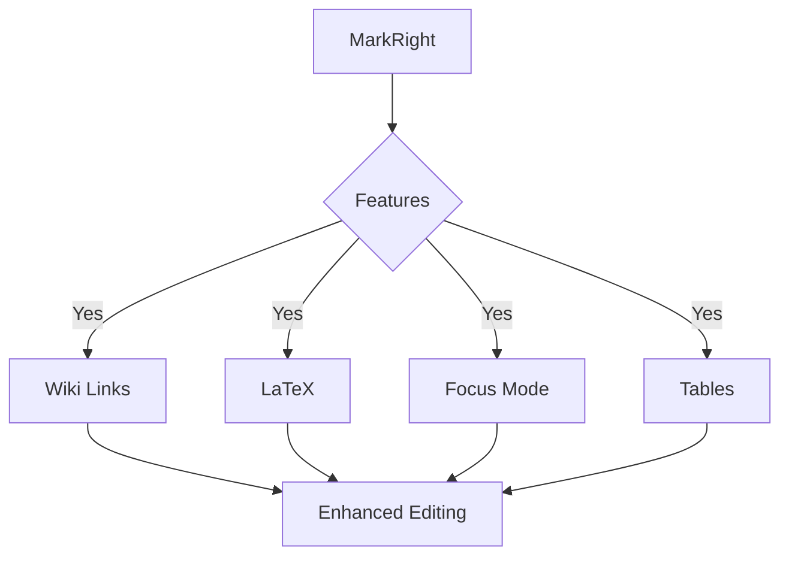

# MarkRight Demo

This is a demonstration of the **MarkRight** extension - an Obsidian-like VSCode markdown editor with enhanced features.

## Features Showcase

### Wiki Links
Here are some examples of wiki-style links:
- [[Home Page]]
- [[Project Documentation]]
- [[Getting Started|Start Here]]

### Mathematics with LaTeX
Inline math: $E = mc^2$ and $\sum_{i=1}^{n} x_i$

Block math:
$$\frac{d}{dx}\left( \int_{0}^{x} f(u) \, du\right)=f(x)$$

### Enhanced Tables
| Feature | Status | Priority |
|---------|--------|----------|
| Wiki Links | ✅ Implemented | High |
| LaTeX Support | ✅ Implemented | High |
| Focus Mode | ✅ Implemented | Medium |
| Diagrams | ✅ Implemented | Medium |

### Code and Diagrams

Here's a simple code block:
```javascript
function greet(name) {
    return `Hello, ${name}!`;
}
```

And a Mermaid diagram:


### Focus Mode
The focus mode allows you to concentrate on:
- **Paragraph mode**: Highlights current paragraph
- **Section mode**: Highlights current section
- **Off mode**: No highlighting

### Custom Styling
The editor supports custom CSS for personalized appearance and enhanced readability.

## Keyboard Shortcuts
- `Ctrl+Shift+M` (or `Cmd+Shift+M`): Open MarkRight Editor
- `Ctrl+Shift+L` (or `Cmd+Shift+L`): Insert Wiki Link
- `Ctrl+B` (or `Cmd+B`): Bold text
- `Ctrl+I` (or `Cmd+I`): Italic text

> This is a blockquote demonstrating the enhanced styling capabilities of MarkRight.

---

Try editing this document with MarkRight to experience the smooth, Obsidian-like editing experience!