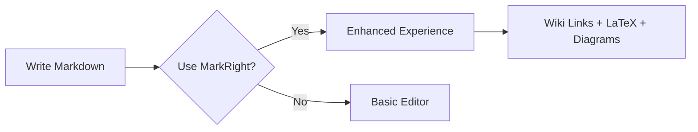

# Quick Start Guide

## Installation
1. Install the MarkRight extension from the VSCode marketplace (or load it in development mode)
2. Open any `.md` file in your workspace
3. Use `Ctrl+Shift+M` (or `Cmd+Shift+M` on Mac) to open the MarkRight editor

## Features Demo

### Wiki Links
Create links between your markdown files using double brackets:
- [[Getting Started]]
- [[API Documentation]]
- [[Troubleshooting Guide]]

### Math with LaTeX
Inline math: $\sin(x) = \sum_{n=0}^{\infty} \frac{(-1)^n x^{2n+1}}{(2n+1)!}$

Block math:
$$\int_{-\infty}^{\infty} e^{-x^2} dx = \sqrt{\pi}$$

### Enhanced Tables
| Command | Shortcut | Description |
|---------|----------|-------------|
| Open Editor | `Ctrl+Shift+M` | Open MarkRight editor |
| Insert Link | `Ctrl+Shift+L` | Insert wiki link |
| Focus Mode | F7 | Toggle focus mode |

### Diagrams

### Focus Modes
Try toggling between different focus modes:
- **Off**: Full document visible
- **Paragraph**: Current paragraph highlighted
- **Section**: Current section highlighted

### Keyboard Shortcuts
- `Ctrl+B`: **Bold** text
- `Ctrl+I`: *Italic* text  
- `Tab`: Indent
- `Shift+Tab`: Unindent

Enjoy your enhanced markdown editing experience with MarkRight!