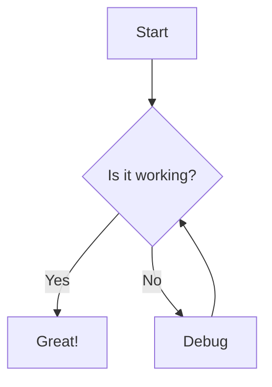

# Test Heading Level 1

This is a test of the heading overlay system.

## Test Heading Level 2

Here we have a second level heading.

### Test Heading Level 3

And a third level heading with some content.

#### Test Heading Level 4

Fourth level heading.

##### Test Heading Level 5

Fifth level heading.

###### Test Heading Level 6

Sixth level heading.

## Table Test

| Header 1 | Header 2 | Header 3 |
| -------- | -------- | -------- |
| Cell 1   | Cell 2   | Cell 3   |
| Cell 4   | Cell 5   | Cell 6   |

## LaTeX Test

$$E = mc^2$$

## Mermaid Diagram Test

